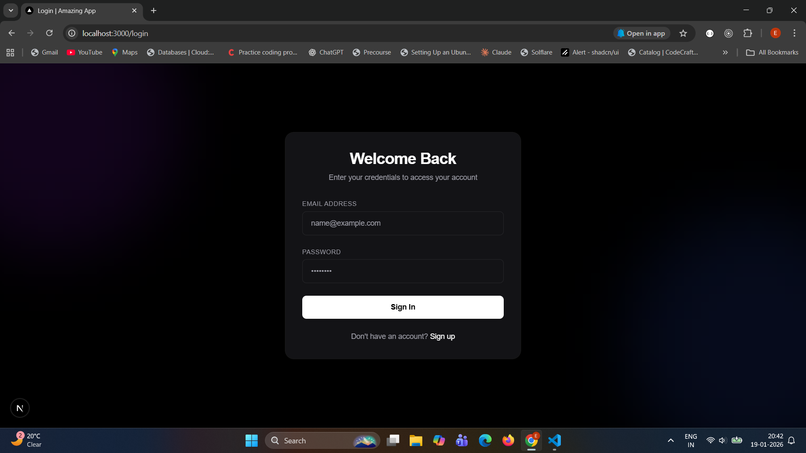
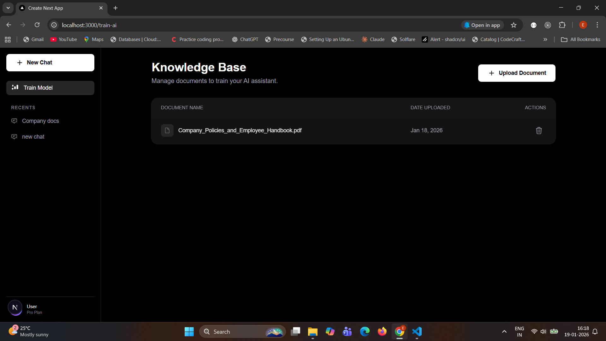
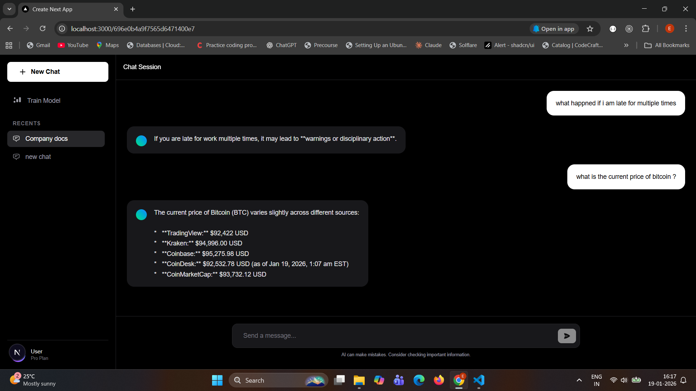

# AI Learning Journey: RAG & Tool Calling 🚀

Hi there! 👋 This project is my personal playground for mastering advanced AI concepts. It is a full-stack application where you can login, upload your own documents to "train" an AI, and then ask questions to get answers based specifically on that content.

The main motive of this project is to learn and experiment with modern AI technologies.

## 🧠 What I Learned

Building this wasn't just about the code; it was about understanding the concepts. Here are the key takeaways:

*   **RAG (Retrieval Augmented Generation)**: I learned how to connect an LLM to custom data so it knows things it wasn't originally trained on.
*   **Google Search**: I integrated a **Google Search** tool, allowing the AI to fetch real-time information from the web when the answer isn't in the documents.
*   **JSON Formatting**: Ensuring the AI outputs data in a structured way that my code can actually use.
*   **LangChain Simplification**: I discovered how LangChain makes life easier by handling the heavy lifting, such as:
    *   **Tool Calling**: It simplifies the process of binding tools (functions) to the LLM and parsing the outputs.
    *   **Document Loaders**: Easily reading PDFs and other files.
    *   **Text Splitters**: Smartly breaking down text so it fits into the context window.
    *   **Embeddings & Querying**: Efficiently turning text into vectors for semantic search.
*   **LangGraph**: This was a game-changer for managing workflows. Instead of writing messy `if-else` logic to handle conversation loops (like "search again" or "ask for clarity"), LangGraph let me build a stateful graph where the AI can cycle through steps intelligently.

## 🌿 Different Versions

To see the progression of my learning, I've saved different versions of the code in separate branches:

1.  **`without-langchain/langgraph`**: The raw, manual implementation. Good for understanding the basics!
2.  **`with-langchain`**: The same app, but refactored to use LangChain's ecosystem.
3.  **`with-langchainAndLanggraph`**: The advanced version adding LangGraph for stateful workflows.

## 📸 A Look Inside

Here are some screenshots of the application in action:

**Login Page**

**Training the AI (Document Upload)**

**Chatting with your Data**

